# 🤖 Tharindu's AI Portfolio Assistant(version 1.0)

[](https://nodejs.org/)
[](https://expressjs.com/)
[](https://ai.google.dev/models/gemini)
[](https://vercel.com/)
[](https://www.linkedin.com/in/tharindunuwantha/)
[](https://github.com/TharinduNuwantha)
[](https://your-portfolio-link.com) 

> A **personal AI-powered chatbot** that acts as **Tharindu Nuwantha’s interactive interview assistant**.  
Deployed live here 👉 [**Chatbot on Vercel**](https://chatbot-at-v1-csv9io31e-tharindunuwanthas-projects.vercel.app/)

---
### 🚀 **Try it Live!**

<p align="center">
  <a href="https://chatbot-at-v1.vercel.app/">
    
  </a>
</p>

<p align="center">
  <a href="https://chatbot-at-v1.vercel.app/">
    
  </a>
  <a href="https://chatbot-at-v1.vercel.app">
    
  </a>
</p>

---

## 📸 Screenshots

> Replace these with real screenshots from your project.

| Landing Page | Example Chat |
|--------------|--------------|
|  |  |

---

### 🚀 **[Live Demo](https://your-deployment-url.vercel.app)** | 📺 **[Video Walkthrough](#-demo)**

*An intelligent AI-powered chatbot that serves as Tharindu Nuwantha's virtual career assistant*

</div>

---

## 📋 Table of Contents

- [Overview](#-overview)
- [Key Features](#-key-features)
- [Demo](#-demo)
- [System Architecture](#-system-architecture)
- [Tech Stack](#-tech-stack)
- [Getting Started](#-getting-started)
- [Project Structure](#-project-structure)
- [API Endpoints](#-api-endpoints)
- [Environment Variables](#-environment-variables)
- [Deployment](#-deployment)
- [Usage Examples](#-usage-examples)
- [Contributing](#-contributing)
- [License](#-license)
- [Contact](#-contact)

---

## 🌟 Overview

This project is a **conversational AI assistant** designed to help recruiters, interviewers, and collaborators learn about **Tharindu Nuwantha** through an interactive Q&A experience. Built with **Google Gemini 2.5 Flash**, the chatbot provides professional, contextual responses based on a structured CV dataset.

### Why This Project?

- 🎯 **For Recruiters**: Get instant answers about skills, experience, and projects
- 🤝 **For Collaboration**: Quick access to technical expertise and contact information
- 💼 **Professional Interview Assistant**: Acts as a 24/7 available interview representative
- 🧠 **AI-Powered Intelligence**: Uses Google's latest Gemini model for natural conversations

---

## ✨ Key Features

<table>
<tr>
<td>

### 🎭 Intelligent Responses
- Context-aware answers using Gemini 2.5 Flash
- Professional tone matching interview scenarios
- Factual responses based only on provided data

</td>
<td>

### 📚 Comprehensive Knowledge
- Education background & certifications
- Technical skills & frameworks
- Project portfolio with live examples

</td>
</tr>
<tr>
<td>

### 🎨 Modern UI/UX
- Terminal-inspired design aesthetic
- Real-time chat interface
- Smooth animations & transitions
- Responsive mobile-first layout

</td>
<td>

### 🔒 Safe & Reliable
- Input validation & error handling
- Safety filters for appropriate responses
- Rate limiting & security best practices
- No data storage or tracking

</td>
</tr>
</table>

---

## 🎥 Demo

<div align="center">

.gif?raw=true)

</div>

### Sample Conversations

```
User: "What are Tharindu's main skills?"
Bot: "I specialize in full-stack development with expertise in the MERN stack 
      (MongoDB, Express.js, React.js, Node.js), mobile development using Flutter 
      and Kotlin, and backend technologies including PHP and Spring Boot..."

User: "Tell me about the Pictarea project"
Bot: "Pictarea.com is a live multimedia platform built with PHP and MySQL. 
      It allows users to browse, download, and print coloring pages, PNGs, 
      wallpapers, and emojis with advanced search and categorization features..."
```

---

## 🏗️ System Architecture

```mermaid
graph TB
    A[🌐 User Browser] -->|HTTP Request| B[⚡ Express.js Server]
    B -->|Load Context| C[(📊 Profile Data JSON)]
    B -->|Generate Prompt| D[🤖 Google Gemini AI API]
    D -->|Process with Context| E[💭 AI Response Generation]
    C -->|CV Dataset| E
    E -->|Generated Reply| B
    B -->|JSON Response| A
    
    style A fill:#4285F4,stroke:#333,stroke-width:2px,color:#fff
    style B fill:#68A063,stroke:#333,stroke-width:2px,color:#fff
    style C fill:#FF6B6B,stroke:#333,stroke-width:2px,color:#fff
    style D fill:#4285F4,stroke:#333,stroke-width:2px,color:#fff
    style E fill:#9B59B6,stroke:#333,stroke-width:2px,color:#fff
```



### Architecture Flow

1. **User Input**: User sends a question through the web interface
2. **Server Processing**: Express.js receives and validates the request
3. **Context Loading**: Profile data (CV) is loaded from JSON structure
4. **Prompt Engineering**: User question + CV data combined into optimized prompt
5. **AI Generation**: Google Gemini processes the prompt with temperature=0.2 for factual accuracy
6. **Response Delivery**: Generated answer sent back to user in real-time

---

## 🛠️ Tech Stack

### Backend
- **Node.js** (v18+) - Runtime environment
- **Express.js** (v5.1.0) - Web framework
- **@google/genai** (v1.21.0) - Gemini AI SDK
- **dotenv** (v17.2.3) - Environment configuration

### Frontend
- **HTML5** - Semantic structure
- **CSS3** - Custom styling with animations
- **Vanilla JavaScript** - Client-side logic

### AI & APIs
- **Google Gemini 2.5 Flash** - Language model
- **REST API** - Communication protocol

### Deployment
- **Vercel** - Serverless hosting platform
- **Git** - Version control

---

## 🚀 Getting Started

### Prerequisites

Ensure you have the following installed:

- [Node.js](https://nodejs.org/) (version 18 or higher)
- npm (comes with Node.js)
- A Google Gemini API key ([Get one here](https://makersuite.google.com/app/apikey))

### Installation

1. **Clone the repository**

```bash
git clone https://github.com/TharinduNuwantha/chatbot-AT-v1-.git
cd chatbot-AT-v1-
```

2. **Install dependencies**

```bash
npm install
```

3. **Set up environment variables**

Create a `.env` file in the root directory:

```bash
# .env
GOOGLE_API_KEY=your_gemini_api_key_here
# Optional: Use GEMINI_API_KEY if preferred
# GEMINI_API_KEY=your_gemini_api_key_here
```

4. **Start the development server**

```bash
npm start
```

5. **Open your browser**

Navigate to `http://localhost:3000`

---

## 📂 Project Structure

```
chatbot-AT-v1-/
├── 📁 public/                 # Frontend assets
│   ├── index.html            # Main HTML file
│   ├── script.js             # Client-side JavaScript
│   ├── style.css             # Styling and animations
│   └── 📁 screenshot/        # Demo screenshots
│
├── server.js                 # Express server + Gemini integration
├── package.json              # Dependencies and scripts
├── .env                      # Environment variables (not in repo)
├── .env.example              # Example environment file
├── .gitignore                # Git ignore rules
└── README.md                 # Documentation
```

### Key Files Explained

| File | Purpose |
|------|---------|
| `server.js` | Backend server handling API requests, Gemini integration, and profile data management |
| `public/script.js` | Frontend logic for chat UI, message handling, and API communication |
| `public/index.html` | Main interface with terminal-inspired design |
| `public/style.css` | Custom styling with animations and responsive layout |

---

## 🔌 API Endpoints

### `POST /chat`

Send a message to the chatbot and receive an AI-generated response.

**Request:**
```json
{
  "message": "What are your technical skills?"
}
```

**Response:**
```json
{
  "reply": "I have expertise in JavaScript, Java, PHP, Kotlin, Dart, C, C++, and web technologies like HTML/CSS. My framework experience includes React.js, Node.js, Express, Spring Boot, and Flutter for mobile development..."
}
```

**Error Responses:**
- `400` - Empty or invalid message
- `500` - Server or Gemini API error

### `GET /_ping`

Health check endpoint to verify Gemini API connection.

**Response:**
```json
{
  "ok": true,
  "text": "pong"
}
```

---

## 🔐 Environment Variables

Create a `.env` file in the root directory with the following variables:

```env
# Required: Google Gemini API Key
GOOGLE_API_KEY=your_api_key_here

# Alternative (preferred by SDK)
GEMINI_API_KEY=your_api_key_here

# Optional: Custom Port
PORT=3000
```

> **Note:** The server prioritizes `GEMINI_API_KEY` over `GOOGLE_API_KEY` if both are present.

---

## 🚢 Deployment

### Deploy to Vercel (Recommended)

1. **Install Vercel CLI**
```bash
npm install -g vercel
```

2. **Deploy**
```bash
vercel
```

3. **Set environment variables**
```bash
vercel env add GOOGLE_API_KEY
```

4. **Deploy to production**
```bash
vercel --prod
```

### Deploy to Other Platforms

<details>
<summary>Heroku</summary>

```bash
# Install Heroku CLI and login
heroku create your-app-name
heroku config:set GOOGLE_API_KEY=your_key_here
git push heroku main
```
</details>

<details>
<summary>Railway</summary>

1. Connect your GitHub repository
2. Add `GOOGLE_API_KEY` in environment variables
3. Deploy automatically on push
</details>

---

## 💡 Usage Examples

### For Recruiters

```
Q: "What projects has Tharindu worked on?"
A: Lists 8+ projects including e-commerce platforms, mobile apps, and live websites

Q: "What is Tharindu's education background?"
A: Provides BSc in IT from SLIIT and relevant certifications

Q: "How can I contact Tharindu?"
A: Shares email, phone, LinkedIn, GitHub, and portfolio links
```

### For Technical Collaboration

```
Q: "What databases does Tharindu use?"
A: MongoDB, MySQL, and Firebase

Q: "Does Tharindu have mobile development experience?"
A: Yes, with Flutter and Native Android (Kotlin)

Q: "What's Tharindu's experience with DevOps?"
A: CI/CD basics, GitHub Actions, and deployment experience
```

---

## 🤝 Contributing

Contributions are welcome! Here's how you can help:

1. **Fork the repository**
2. **Create a feature branch** (`git checkout -b feature/AmazingFeature`)
3. **Commit your changes** (`git commit -m 'Add some AmazingFeature'`)
4. **Push to the branch** (`git push origin feature/AmazingFeature`)
5. **Open a Pull Request**

### Areas for Improvement

- [ ] Add conversation history/memory
- [ ] Implement voice input/output
- [ ] Add multilingual support
- [ ] Create admin dashboard
- [ ] Add analytics tracking
- [ ] Implement user feedback system

---

## 📄 License

This project is licensed under the MIT License - see the [LICENSE](LICENSE) file for details.

---

## 📞 Contact

**Tharindu Nuwantha**

- 📧 Email: tharindunuwantha77@gmail.com
- 💼 LinkedIn: [@tharindu-nuwantha](https://www.linkedin.com/in/tharindu-nuwantha/)
- 🐙 GitHub: [@TharinduNuwantha](https://github.com/TharinduNuwantha)
- 🌐 Portfolio: [pictarea.com](https://pictarea.com/)
- 📱 Phone: +94 71 589 3934

---

<div align="center">

### ⭐ If you find this project helpful, please consider giving it a star!

**Made with ❤️ by Tharindu Nuwantha**

[⬆ Back to Top](#-tharindus-personal-ai-assistant)

<
